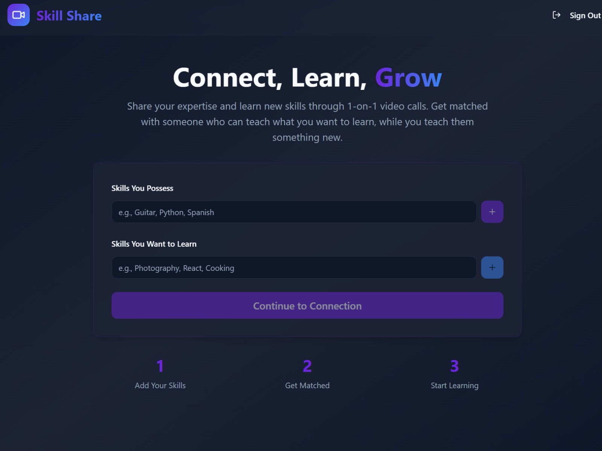

# SkillShare

A modern web application that connects people to exchange skills and knowledge through real-time video calls. SkillShare enables users to find skill-sharing partners, join waiting rooms, and conduct peer-to-peer video conversations with built-in chat functionality.
### Home / Dashboard

### Waiting Room

### Meeting Room

### Chatbox

## 🌟 Features

- **User Authentication**: Secure sign-up and login using Supabase Authentication
- **Skill-Based Matching**: Users specify skills they possess and want to learn, then get matched with compatible partners
- **Real-Time Matching**: Instant skill-based pairing with automatic waiting room management
- **Video Calling**: Full-featured WebRTC peer-to-peer video calls with:
  - Microphone and camera controls
  - Screen sharing capabilities
  - Call error handling and error boundaries
- **In-Call Chat**: Real-time text messaging during video calls
- **Responsive UI**: Modern, accessible interface built with shadcn/ui components
- **Error Handling**: Graceful error recovery with user-friendly notifications

## 🛠️ Tech Stack

### Frontend
- **React 18**: UI framework with TypeScript
- **Vite**: Lightning-fast build tool and dev server
- **shadcn/ui**: High-quality, accessible UI components
- **TailwindCSS**: Utility-first CSS framework
- **React Router**: Client-side routing
- **React Query**: Server state management
- **React Hook Form**: Form state management
- **Lucide React**: Icon library

### Backend & Database
- **Supabase**: Backend-as-a-service platform providing:
  - PostgreSQL database
  - Real-time subscriptions
  - Authentication
  - Row-level security (RLS)

### Real-Time Communication
- **WebRTC**: Peer-to-peer video and audio
- **Supabase Realtime**: Broadcasting and presence for signaling

## 📁 Project Structure

```
src/
├── pages/
│   ├── Index.tsx           # Home page with skill selection
│   ├── Auth.tsx            # Login/signup page
│   ├── Call.tsx            # Video call interface
│   └── NotFound.tsx        # 404 page
├── components/
│   ├── SkillInput.tsx      # Skill input component
│   ├── WaitingRoom.tsx     # Waiting room for matched users
│   └── ui/                 # shadcn UI components
├── hooks/
│   ├── use-toast.ts        # Toast notifications hook
│   └── use-mobile.tsx      # Mobile detection hook
├── integrations/
│   └── supabase/
│       ├── client.ts       # Supabase client initialization
│       └── types.ts        # Database type definitions
├── lib/
│   └── utils.ts            # Utility functions
├── App.tsx                 # Main app component with routing
└── main.tsx                # React entry point
```

## 🚀 Getting Started

### Prerequisites
- Node.js 16+ or Bun
- A Supabase account and project

### Installation

1. **Clone the repository**
   ```bash
   git clone <repository-url>
   cd SkillShare
   ```

2. **Install dependencies**
   ```bash
   bun install
   # or
   npm install
   ```

3. **Set up environment variables**
   
   Create a `.env.local` file in the root directory:
   ```
   VITE_SUPABASE_URL=your_supabase_url
   VITE_SUPABASE_ANON_KEY=your_supabase_anon_key
   ```

4. **Initialize Supabase**
   ```bash
   supabase link --project-ref rguxqlmngejjqagyesyr
   supabase db push
   ```

5. **Start the development server**
   ```bash
   bun run dev
   # or
   npm run dev
   ```

   The app will be available at `http://localhost:8080`

## 📦 Available Scripts

- `bun run dev` - Start development server with hot reload
- `bun run build` - Build for production
- `bun run build:dev` - Build in development mode
- `bun run lint` - Run ESLint
- `bun run preview` - Preview production build locally

## 🔐 Database Schema

### Tables

#### `waiting_room`
Manages users waiting for skill-based matches
- `user_id` - User's unique identifier
- `skills_possess` - Array of skills the user has
- `skills_want` - Array of skills the user wants to learn
- `status` - Current status ('waiting' or 'matched')
- `matched_with` - User ID of matched partner

#### `call_sessions`
Tracks active video call sessions
- `initiator_id` - User who initiated the call
- `receiver_id` - User who received the call
- `status` - Call status ('pending', 'active', 'ended')
- `start_time` - When the call started
- `end_time` - When the call ended

## 🔄 User Flow

1. **Authentication**: User signs up or logs in
2. **Skill Selection**: User enters skills they possess and want to learn
3. **Waiting Room**: User enters waiting room while the system searches for a match
4. **Matching**: When compatible skills are found, users are matched
5. **Video Call**: Users can see each other via WebRTC, share screen, and chat
6. **Call End**: Users can end the call and return to home page

## 🎨 UI Components

The project uses shadcn/ui components for consistent, accessible design:
- Buttons, Cards, Dialogs, Inputs
- Badges, Alerts, Toasts
- Forms with React Hook Form integration
- And 30+ more components available

## 🌐 Real-Time Features

- **Supabase Realtime**: Enables instant updates for:
  - Waiting room status changes
  - Match notifications
  - Call session updates
  - Chat messages

## ⚠️ Error Handling

- **Error Boundaries**: React error boundary in Call component prevents complete app crashes
- **Toast Notifications**: User-friendly error messages
- **Graceful Fallbacks**: Media access errors handled with fallback states
- **Polling Resilience**: Backup polling mechanism for match detection

## 🎯 Key Components

### SkillInput Component
Reusable component for managing skill input with:
- Add/remove skill functionality
- Badge display
- Enter key support

### WaitingRoom Component
Handles match searching with:
- Real-time polling
- Status subscriptions
- Animated loading states
- Automatic navigation on match

### Call Component
Comprehensive video call handler with:
- Local/remote stream management
- Media device controls
- Screen sharing
- Error boundaries
- Chat functionality

## 🔧 Configuration

### Vite Configuration
- Hot module replacement enabled
- Path aliases for clean imports (`@` → `src/`)
- Development server on port 8080

### Tailwind CSS
Customizable theme configuration in `tailwind.config.ts`

### TypeScript
Strict type checking with path aliases for better DX

## 📱 Responsive Design

The application is fully responsive and works across:
- Desktop browsers
- Tablets
- Mobile devices (with appropriate permissions)

## 🚨 Known Limitations

- WebRTC requires secure context (HTTPS in production)
- Camera/microphone permissions required for video calls
- Browser support depends on WebRTC implementation

## 🤝 Contributing

Contributions are welcome! Please follow the existing code style and create feature branches for new functionality.

## 📄 License

This project is private. Please contact the maintainers for licensing information.

## 📞 Support

For issues or questions, please reach out to the development team or check the project's issue tracker.

---

**Built with ❤️ using React, TypeScript, and Supabase**

There are several ways of editing your application.

**Use Lovable**

Simply visit the [Lovable Project](https://lovable.dev/projects/a9ce6962-c468-4d42-ade7-b6f5745160a8) and start prompting.

Changes made via Lovable will be committed automatically to this repo.

**Use your preferred IDE**

If you want to work locally using your own IDE, you can clone this repo and push changes. Pushed changes will also be reflected in Lovable.

The only requirement is having Node.js & npm installed - [install with nvm](https://github.com/nvm-sh/nvm#installing-and-updating)

Follow these steps:

```sh
# Step 1: Clone the repository using the project's Git URL.
git clone <YOUR_GIT_URL>

# Step 2: Navigate to the project directory.
cd <YOUR_PROJECT_NAME>

# Step 3: Install the necessary dependencies.
npm i

# Step 4: Start the development server with auto-reloading and an instant preview.
npm run dev
```

**Edit a file directly in GitHub**

- Navigate to the desired file(s).
- Click the "Edit" button (pencil icon) at the top right of the file view.
- Make your changes and commit the changes.

**Use GitHub Codespaces**

- Navigate to the main page of your repository.
- Click on the "Code" button (green button) near the top right.
- Select the "Codespaces" tab.
- Click on "New codespace" to launch a new Codespace environment.
- Edit files directly within the Codespace and commit and push your changes once you're done.

## What technologies are used for this project?

This project is built with:

- Vite
- TypeScript
- React
- shadcn-ui
- Tailwind CSS

## How can I deploy this project?

Simply open [Lovable](https://lovable.dev/projects/a9ce6962-c468-4d42-ade7-b6f5745160a8) and click on Share -> Publish.

## Can I connect a custom domain to my Lovable project?

Yes, you can!

To connect a domain, navigate to Project > Settings > Domains and click Connect Domain.

Read more here: [Setting up a custom domain](https://docs.lovable.dev/features/custom-domain#custom-domain)
